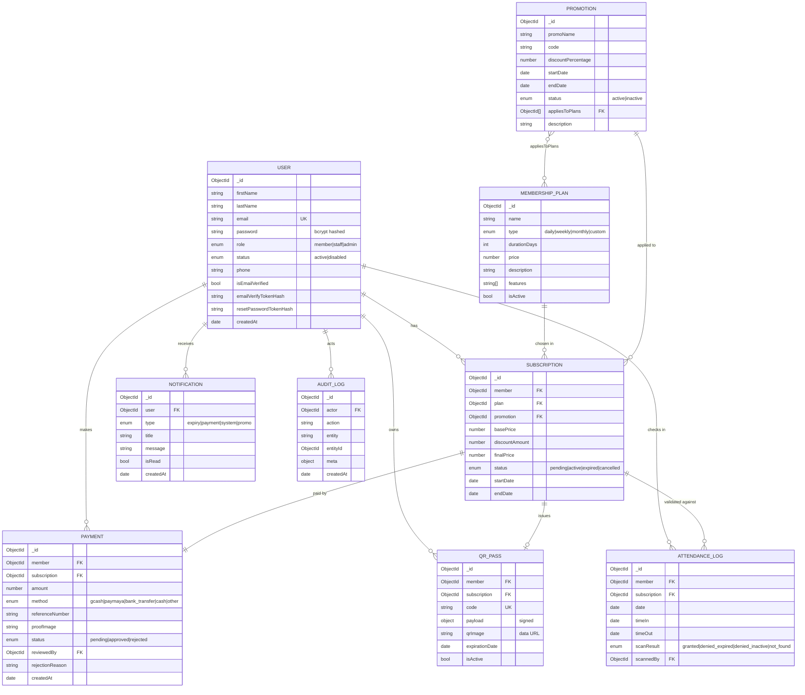

# 🗄️ Database Schema

MongoDB (Mongoose) collections and their relationships for the Gym Membership
Information System.

## Entity-Relationship Diagram



## Collection Notes

| Collection | Key fields / indexes | Notes |
|------------|----------------------|-------|
| **users** | unique `email` | bcrypt pre-save hash; `toJSON` strips password & token hashes; `fullName` virtual |
| **membershipplans** | `isActive` | `durationDays` drives subscription end date |
| **promotions** | `code`, `status` | `isLive` virtual = active **and** within date window |
| **subscriptions** | `member`, `status` | `isCurrent` virtual; pricing = base − discount = final |
| **payments** | `member`, `subscription`, `status` | proof stored on Cloudinary or local `/uploads`; approval activates subscription |
| **qrpasses** | unique `code` (`GYM-…`) | payload HMAC-signed with `QR_SECRET`; `qrImage` is a data URL |
| **attendancelogs** | `member`, `date`, `scanResult` | created on each scan; `timeOut` set on second scan of the day |
| **notifications** | `user`, `isRead` | in-app + optional email |
| **auditlogs** | `actor`, `createdAt` | fire-and-forget admin action trail |

## Core Workflow

```
Member subscribes ──▶ Subscription(pending) ──▶ Payment(pending, +proof)
        │                                              │
        ▼                                              ▼
  Admin reviews payment ──approve──▶ Subscription(active) + QR Pass issued + Notification
        │
        └──reject──▶ Payment(rejected, reason) ──▶ Member notified

Member at gym ──▶ Staff scans QR ──▶ verify signature + status
        ├─ valid & active   ──▶ AttendanceLog(granted)
        ├─ expired          ──▶ AttendanceLog(denied_expired)
        ├─ inactive/cancel  ──▶ AttendanceLog(denied_inactive)
        └─ bad/unknown code ──▶ AttendanceLog(not_found)

Daily cron (08:00) ──▶ expiry reminders (7/3/1 days) + auto-expire past-due subscriptions
```
